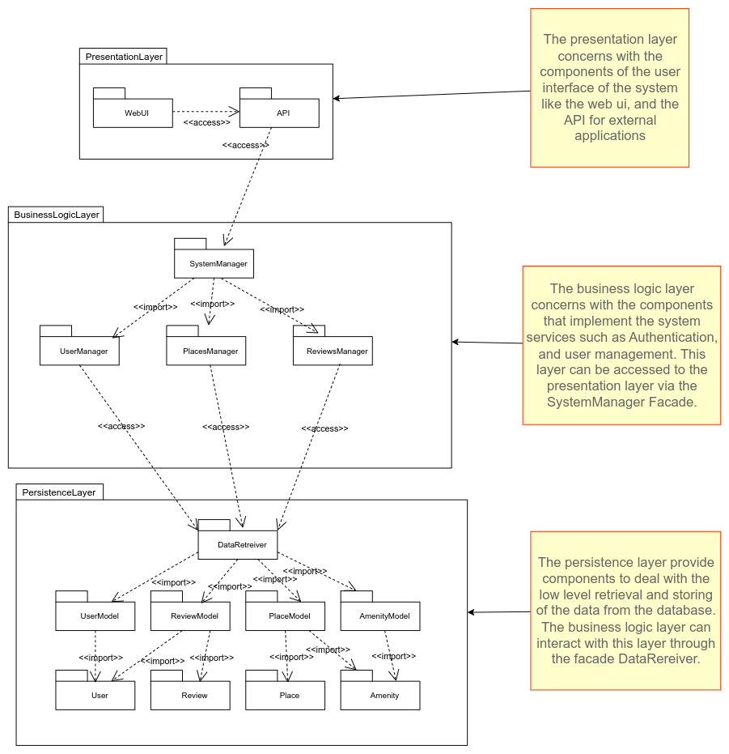
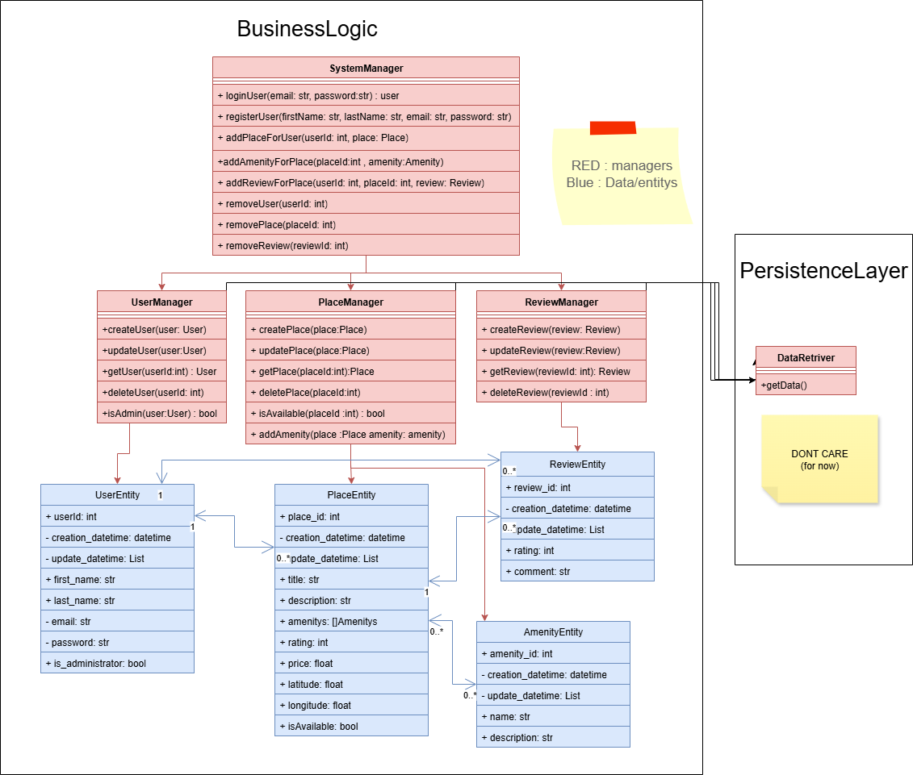

# HBNB Documentation
## Introduction
The purpose of this document is to provide a detailed description of the HBnB
project enabling efficient development, deployment, and maintenance. This
documentation will cover: the problem description, the high-level package
diagram, class diagram, and the sequence diagram of the API calls.

## Problem Description
The HBnB project is a rental management system. And provide the following
services for its users: user management, places management, review management,
and amenity management.

## High Level Package Diagram
The HBnB system will follow a layered architecture. And each layer will have
different components and a facade to provide an interface for other layers. You
can see the high level package diagram in the figure below:

The presentation layer will have the responsibility of managing the user
interface. And it can communicate with the business logic layer through the
system manager facade to access system services. This layer is composed from two
component: *webui* which will manage the web user interface, and *api* which
will manage the api of the system for other systems. The *webui* will use the
*api* to communicate with the system services.

The business logic layer will have the responsibility of implementing the main
system services to the other layers. This layer is composed from the following
components: *system manager* to provide an easy to use interface for the other
layers, and *manager* components to provide the functionality to manage each
system service. This layer will make use of the *data retreiver* facade to
access the system data in a secure and efficient way.

The persistence layer have the responsibilty of managing the low level data
access to the system and its representation. This layer is composed from the
following components: *data retreiver* this component acts as a facade to
provide an easy to use interface for other layers, and a *model* component for
all entity in the system which describe their representation and provide the
functionality to access it.

---
# Class diagram/ business logic
this diagram is about the Class diagram/ business logic for HBNB project 
we will use it as a stepping stone to build the project

## explnition 
this diagram will show how we set up the connection of the data with its managers
that will help when we start so we dont start from 0 its just a base idea

we ues a System manager that will use more managers to handle data classes
and we explain each entity with its relations with each other 
